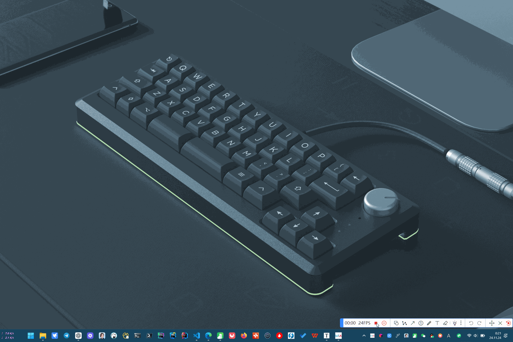
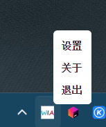
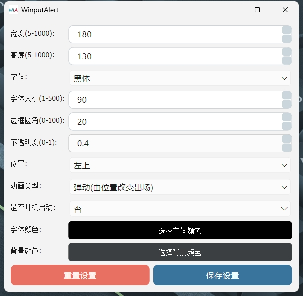

# 🎁简介

  

<h3 align="center">
WinputAlert 是一款基于 Python 开发的输入法状态切换提示的GUI应用
</h3>

# 🎈展示

  

    
    
  

  

    
    
  

  

    
    
  

  

    
    
  

# 💬简单聊聊

用过宏碁`Acer`电脑的小伙伴应该都知道，安装了宏碁的QuickAccess  这个东西之后，按下 `Caps` 大小写按键会显示大小写的切换，但是由于外国人都是用英文，所以就没有显示中文的功能，于是我就用 `Python`做了一个能提示大小写和中英文的软件，笔者使用的电脑屏幕缩放非常小，所以打字切换输入法的时候看状态栏的切换变化是很累眼的。但是又不想使用一直悬浮着的输入法状态栏，对于喜欢简洁的笔者来说过于碍眼。

另外部分 `Windows` 的用户因该遇到过按下输入法却发现输入法没有被切换的情况，曾经在贴吧有很多人反馈，所以做了这个软件，虽然不呢解决微软系统 cao dan 的 bug，但是通过这个软件切换输入法的时候能够直观看到切换状态，算是比较安心。

这个软件主要原理是识别`shift`、`ctrl+space`和`caps`切换输入法、大小写来判断输入法GUI是否显示，其他情况下不会显示。

目前仅支持`Window`，还不打算做`Mac`和`Linux`，`Pyside6`开发难度实在比使用`html`来的艰难。

# 👋使用方式

## 方式一（通过main.py启动）

git clone 源代码到本地

    git clone https://gitee.com/sinvon/WinputAlert.git

进入WinputAlert根目录

    cd ./WinputAlert

创建虚拟环境

    python -m venv venv

安装必要的库

    pip install -r requirements.txt

运行

    briefcase dev

## 方式二（通过 msi 安装（msi即windows专用安装程序））

在链接🔗xxx 中找到msi后缀的安装包下载后按指导安装即可

# ✈️原理

🚀 通过 win32Api 检测键盘状态找到句柄，只有在按下shift（shift为左右shift任一）、caps、ctrl+space（ctrl为左右ctrl任一）时检测输入法和大写锁定状态的变化，并相应地显示合适的 GUI 窗口，且能在一定时间后自动隐藏窗口，而不是重新建立GUI示例，从而提高GUI切换的响应速度，同时节约CPU资源。

🚀 关键点：在最后一次按下按键之后开始对GUI的隐藏延迟时间开始计时（重置计时器），避免计时之后连续按下按键导致GUI瞬间消失。

# ✨使用的库

* psutil
* PySide6
* PySide6-stubs 解决PySide6语法提示问题
* PySide6_Addons
* PySide6_Essentials
* pywin32
* briefcase
* keyboard

# ⚠️注意（可能遇到的问题）

* 如何安装 keyboard ？
  * python3 -m pip install keyboard ( keyboard 需要通过 python3 -m pip install keyboard 安装, 不然安装了会检测不到模块)
  * import keyboard # 用于监听键盘事件
* 如何安装 pyqt5 ？
  * pip install PyQt5
  * pip install PyQt5-stubs (用于解决PyQt5没有语法智能提示的问题)
  * 参考：[vscode中PyQt5模块代码提示问题_vscode pyqt5 qtchart 代码提示-CSDN博客](https://blog.csdn.net/qq527703883/article/details/116536345)
* 如何解决 pyqt5 未找到模块的问题？
  * 执行了pip uninstall pyqt5 (https://so.csdn.net/so/search?q=pyqt5&spm=1001.2101.3001.7020)和pip3 uninstall pyqt5，再pip3 install pyqt5，然后再试了下pip install pyqt5，就好了。
  * 参考：[报错 No module named ‘PyQt5.QtWidgets‘等_no module named 'pyqt5.qtwidgets-CSDN博客](https://blog.csdn.net/qq_39938666/article/details/121895038)
* .venv 和根目录的名称有关，如果根目录文件夹改名了，需要重建 .venv

# 🚀改进

1. 从PyQt5换成了PySide6（PySide6部分组件向下兼容PyQt5）
2. 使用 Briefcase 构建重构项目，可将Python项目打包成可执行文件 msi、exe、dmg、deb等等

# 最后
PySide 和 PyQt 写的东西虽然运行的时候占用小，但是磁盘占用较大，这点比较可惜。