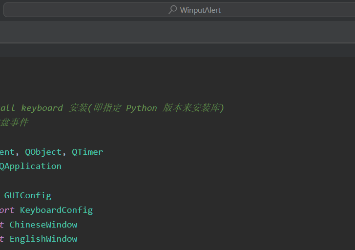

# 🎁简介

WinputAlert 是一款基于 Python 开发的输入法状态切换提示的GUI应用

# 👋使用方式

## 方式一（通过main.py启动）

git clone 源代码到本地

```
git clone https://gitee.com/sinvon/WinputAlert.git
```

进入WinputAlert根目录

```
cd ./WinputAlert
```

激活虚拟环境

```
python -m venv venv
```

安装必要的库

```
pip install requirements.txt
```

运行 main.py 即可

```
python3 main.py
```

## 方式二（通过 msi 安装（msi即windows专用安装程序））

# ✈️原理

🚀 通过 win32Api 检测键盘状态找到句柄，只有在按下shift（shift为左右shift任一）、caps、ctrl+space（ctrl为左右ctrl任一）时检测输入法和大写锁定状态的变化，并相应地显示合适的 GUI 窗口，且能在一定时间后自动隐藏窗口，而不是重新建立GUI示例，从而提高GUI切换的响应速度，同时节约CPU资源。

🚀 关键点：在最后一次按下按键之后开始对GUI的隐藏延迟时间开始计时（重置计时器），避免计时之后连续按下按键导致GUI瞬间消失。

# 🎈展示

这是我切换中英文、切换大小写之后的的效果



# ✨使用的库

- PyQt5
- keyboard
- ctypes

# ⚠️注意

- 如何安装 keyboard ？

  - python3 -m pip install keyboard ( keyboard 需要通过 python3 -m pip install keyboard 安装, 不然安装了会检测不到模块)
  - import keyboard  # 用于监听键盘事件
- 如何安装 pyqt5 ？

  - pip install PyQt5
  - pip install PyQt5-stubs (用于解决PyQt5没有语法智能提示的问题)
  - 参考：[vscode中PyQt5模块代码提示问题_vscode pyqt5 qtchart 代码提示-CSDN博客](https://blog.csdn.net/qq527703883/article/details/116536345)
- 如何解决 pyqt5 未找到模块的问题？

  - 执行了pip uninstall[pyqt5](https://so.csdn.net/so/search?q=pyqt5&spm=1001.2101.3001.7020)和pip3 uninstall pyqt5，再pip3 install pyqt5，然后再试了下pip install pyqt5，就好了。
  - 参考：[报错 No module named ‘PyQt5.QtWidgets‘等_no module named &#39;pyqt5.qtwidgets-CSDN博客](https://blog.csdn.net/qq_39938666/article/details/121895038)
- .venv 和根目录的名称有关，如果根目录文件夹改名了，需要重建 .venv
